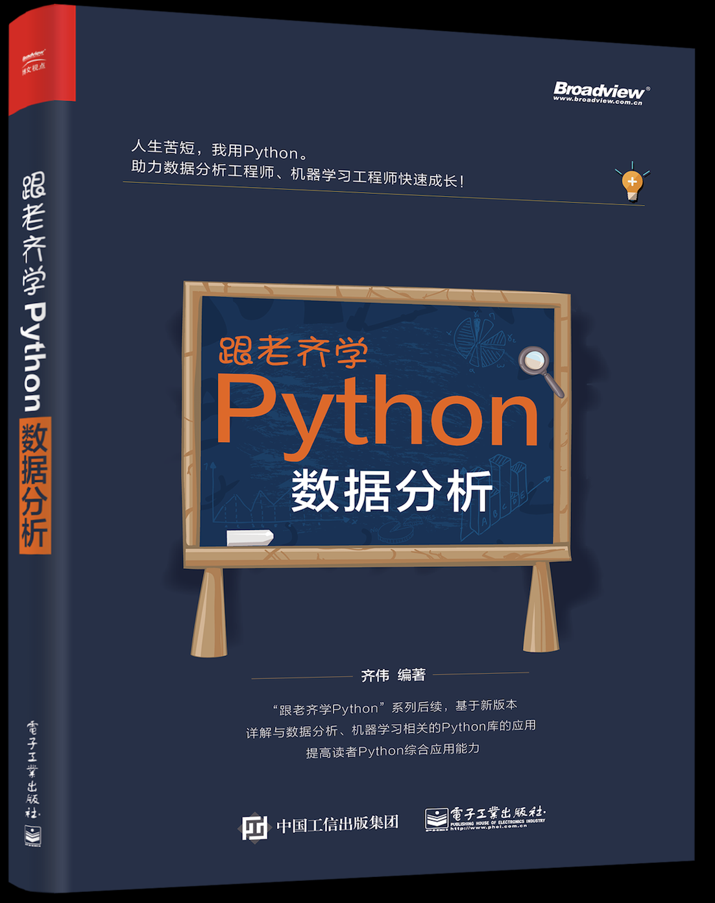

# 《跟老齐学Python:数据分析》是一本关于数据分析、机器学习入门读物，面向初学者。

本仓库为此书源码。

本书由【电子工业出版社】出版，其[天猫旗舰店](https://detail.tmall.com/item.htm?spm=a230r.1.14.34.1b6b7012FYy4G1&id=571483296637&ns=1&abbucket=17&ybhpss=c3VicGxhdD13ZWlibyZwYWdlPXNob3BfaW5kZXgmY3BpZD0wJmNudGlkPTAmcHVpZD0xNDQ5NDgyMjgzJnBndWlkPTEmdHM9MTUzMDkzMDYwMCZjaGFubmVsPTAsMCZpdGVtX2lkPTU3MTQ4MzI5NjYzNyZwaXRlbWlkPTIxODAxNTMwNjE1ODM0MDAwMDc0MDExNSYmbGFiZWw9d2VpYm9fY2NfYnV5)有售。

此外，在京东、当当也有销售。

读者根据需要选用。

