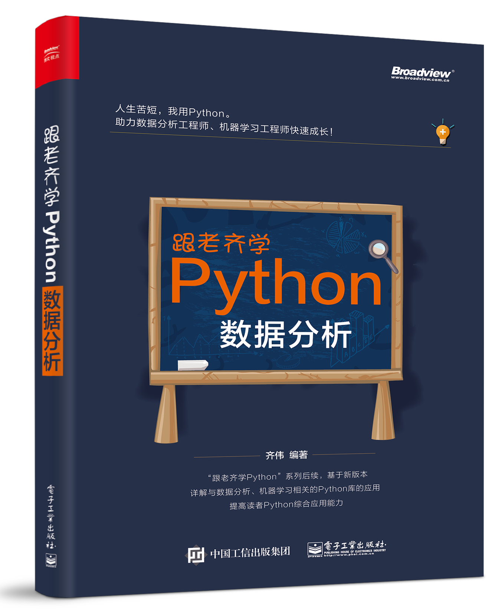

# 《跟老齐学Python：数据分析》勘误



本书课作为数据分析工程师、机器学习工程师的入门教程。

## 版次：2018年6月第1版

## 印次：2019年7月第3次印刷

### 页面：2

- 位置：正文第4自然段
- 原文：~~打开计算机，通过查看文件属性，能直观地看到每个文件中数量的多少。~~这几年，随着网络的发展，某些数据的数值太大了。
- 修订：这几年，随着网络的发展，某些数据的数值太大了。
- 说明：删除“打开计算机...... 数量的多少”这一句。

### 页面：5

- 位置：正文第9段
- 原文：~~本书所有代码都是基于Ubuntu …… 操作系统。~~
- 说明：删除本段。

### 页面：11

- 位置：正文第2段
- 原文：除使用dir()外，还有另外一~~个查看当前对象属性和方法的~~操作~~方式~~。
- 修订：除使用dir()外，还有另外一种操作。

### 页面：15

- 位置：代码 In[18]
- 原文：```b = np.array([1, 2, 3, 4], dtype=float)    ②```
- 修订：```b = np.array([1, 2, 3, 4], dtype=float)    #②```
- 说明：在原语句后面增加注释符号 #

